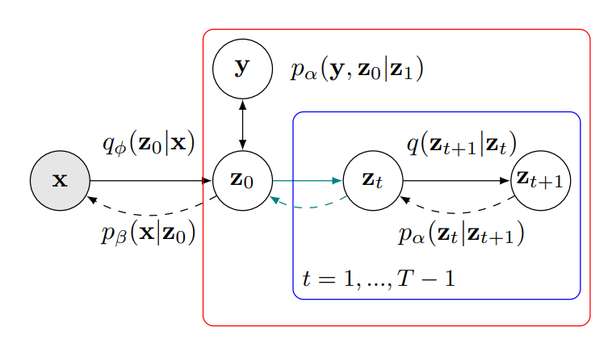

# Latent Diffusion Energy-Based Model for Interpretable Text Modeling


[[Paper]()] [[Code](https://github.com/yuPeiyu98/LDEBM)]

The official code repository for ICML 2022 paper "Latent Diffusion Energy-Based Model for Interpretable Text Modeling".

## Installation

The implementation depends on the following commonly used packages, all of which can be installed via conda (TO ADD).

| Package       | Version                          |
| ------------- | -------------------------------- |
| PyTorch       | ≥ 1.8.1                          |
| numpy         | *not specified* (we used 1.20.0) |


## Datasets and Pretrained Models

Pretrained models are available at: https://drive.google.com/drive/folders/1XWu7olAoYbrKmh8Hnu_zROKhhd3TtmhS?usp=sharing

## Training

```bash
# Run the corresponding task scripts
python <TASK_SCRIPT>.py --gpu <GPU_ID> --max_kl_weight <WEIGHT_OF_KLD> --mutual_weight <WEIGHT_OF_MI> --cls_weight <WEIGHT_OF_CLS_LOSS>
```

You may specify the value of arguments for training. Please find the available arguments in the corresponding task scripts in the `workspace` folder.

## Testing

```bash
# Evaluate the trained model
python <TASK_SCRIPT>.py --gpu <GPU_ID> --forward_only True
```

## Citation

```
@inproceedings{yu2022latent,
  author = {Yu, Peiyu and Xie, Sirui and Ma, Xiaojian and Jia, Baoxiong and Pang, Bo and Gao, Ruiqi and Zhu, Yixin and Wu, Ying Nian and Zhu, Song-Chun},
  title = {Latent Diffusion Energy-Based Model for Interpretable Text Modeling},
  booktitle = {Proceedings of International Conference on Machine Learning (ICML)},
  month = {July},
  year = {2022}
}
```
